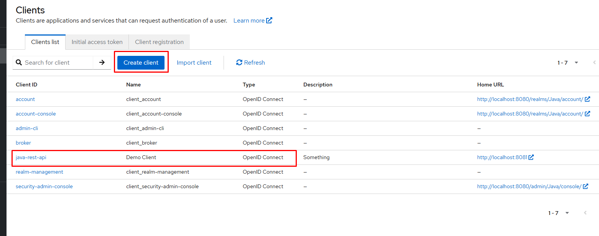
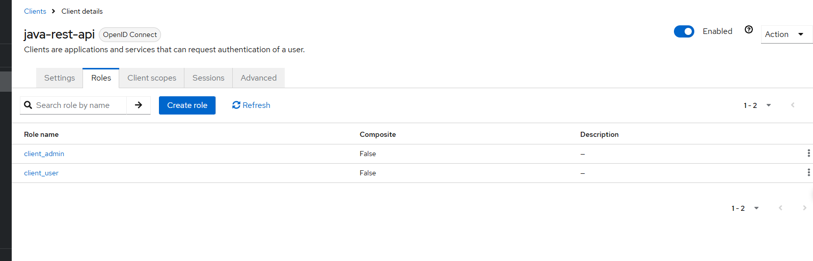
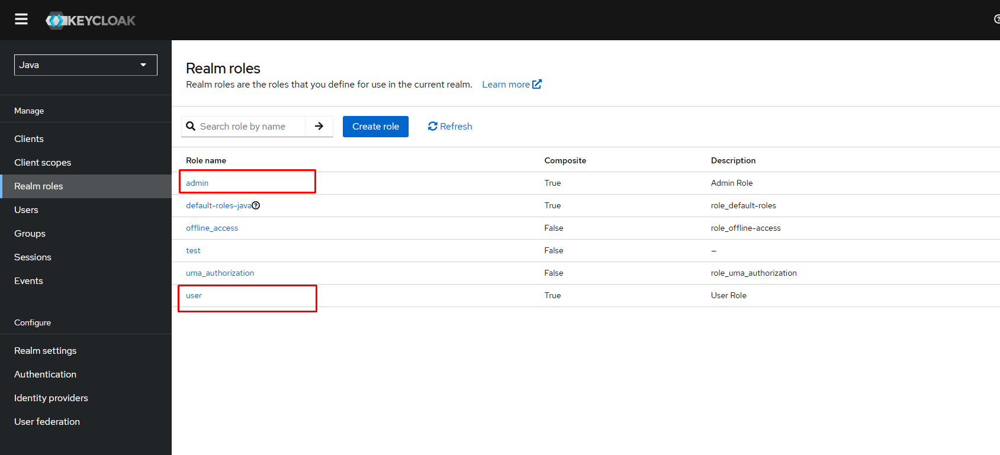
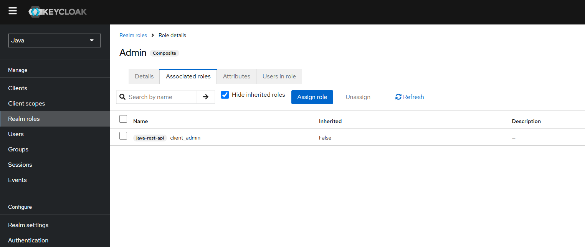
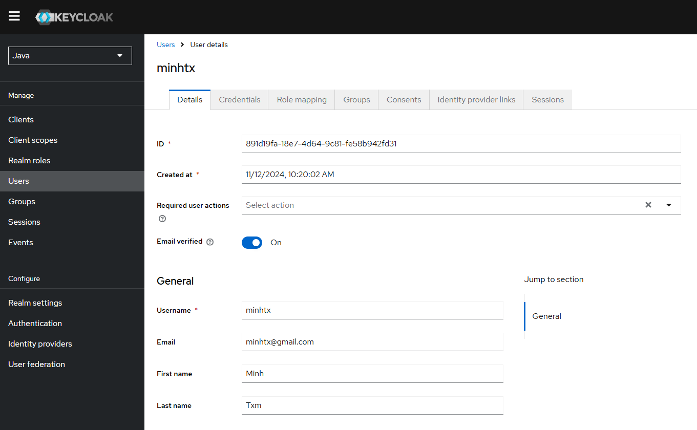
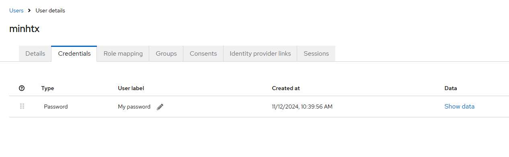
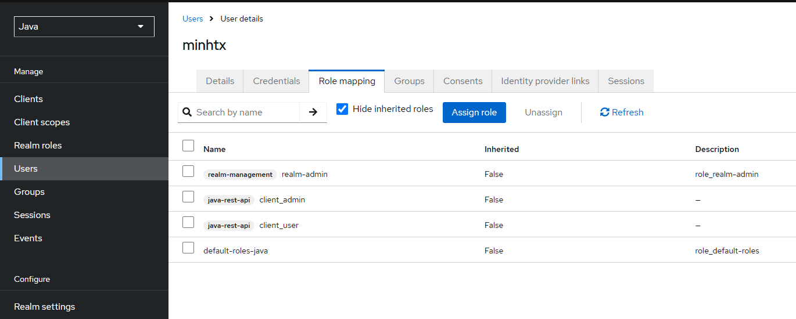

# Keycloak Integration with Spring Boot

## Description

This project demonstrates how to secure a Spring Boot application using Keycloak

## Table of Contents (Optional)
 
- [Getting Started](#getting-started)
   - [Technology](#technology)
   - [Installation](#installation)
- [Usage](#usage)
- [Contributing](#contributing)
- [License](#license)

## Getting Started

Follow the instructions below to set up the project on your local machine for development and testing purposes.

### Technology

Spring Web, Spring Security, spring Oauth2 Resource Server 

### Installation

Keycloak Setup: https://www.keycloak.org/getting-started/getting-started-docker

1. From a terminal, enter the following command to start Keycloak:

```
  docker run -p 8080:8080 -e KC_BOOTSTRAP_ADMIN_USERNAME=admin -e KC_BOOTSTRAP_ADMIN_PASSWORD=admin quay.io/keycloak/keycloak:26.0.5 start-dev
```

2. Log in to the Admin Console:
   
   http://localhost:8080/admin/master/console/

3. Create a realm:
   A realm in Keycloak is equivalent to a tenant. Each realm allows an administrator to create isolated groups of applications and users. Initially, Keycloak includes a single realm, called master. Use this realm only for managing Keycloak and not for managing any applications.

4. Create client:
   
  * Client type: OpenID Connect

  * Client ID: myclient (Example: java-rest-api)

  

  In tab Roles, create 2 role client_admin and client_user

  

5. Create Realms roles:

   * Create 2 role admin and user
     

   
  
   * Associated roles to Client Role
     

   
   
7. Create a user:
   
  Fill in the form with the following values:

    * Username: myuser
  
    * First name: any first name
  
    * Last name: any last name

  

  This user needs a password to log in:
  
    * Click Credentials at the top of the page.

    * Fill in the Set password form with a password.

    * Toggle Temporary to Off so that the user does not need to update this password at the first login

   
   

8. Assign Client Roles to User:

    Click Role mapping, Assign role to Client Roles and Realm Admin

    
   
## Contributing

Contributions are welcome! Please read our [CONTRIBUTING.md](CONTRIBUTING.md) for details on how to contribute to this project.

## License

This project is licensed under the [MIT License](LICENSE).

## Contact

[TxmMinh] - [contact@txmminh.com]
 
 
